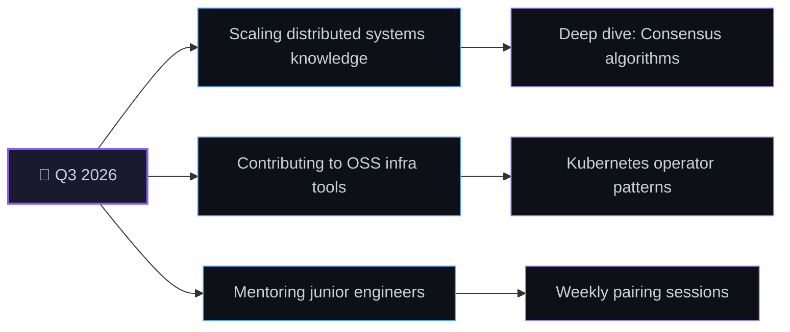

<div align="center">


<br>

<a href="https://github.com/yasinjbd">
  
</a>

<br><br>


<br><br>


</div>

<br>


<br>

##  About Me

<table width="100%"> <tr> <td width="65%" valign="top">

```ts
const yasin = {
  role: "Senior Software Engineer",
  location: "🌍 Remote / Global",
  focus: [
    "Distributed Systems",
    "Product Engineering",
    "DX Tooling"
  ],
  philosophy: "Simplicity is the ultimate sophistication.",
  currentlyBuilding: "developer-first tools that scale gracefully",
  funFact: "I refactor for fun on weekends 😅"
};
```

<br>

  

<br><br>

I design and build production-grade software — from resilient backend services to interfaces that feel effortless.

I care deeply about architecture that ages well, readable code, and shipping things that matter.

When I'm not writing code, I'm reading about distributed systems, contributing to open source, or mentoring engineers earlier in their journey.

</td>

<td width="35%" valign="top" align="center">


</td> </tr> </table>

<br>


<br>

##  Tech Stack

<div align="center">

### Backend


<br><br>

### Frontend


<br><br>

### Database


<br><br>

### Tools


<br><br>

### DevOps & Cloud


</div>

<br>


<br>

##  GitHub Analytics

<div align="center">


<br><br>


<br><br>


<br><br>


<br><br>

### 🐍 Contribution Snake

<picture>   <source     media="(prefers-color-scheme: dark)"     srcset="https://raw.githubusercontent.com/yasinjbd/yasinjbd/output/github-contribution-grid-snake-dark.svg">   <source     media="(prefers-color-scheme: light)"     srcset="https://raw.githubusercontent.com/yasinjbd/yasinjbd/output/github-contribution-grid-snake.svg">    </picture>

<br>

<sub> ⚙️ Powered by <a href="https://github.com/Platane/snk">Platane/snk</a> — auto-generated daily via GitHub Actions </sub>

</div>

<br>


<br>

##  Featured Projects

<table width="100%"> <tr>

<td width="50%" valign="top">

###  Nova — Real-Time Analytics Engine

> A distributed event-processing pipeline handling millions of events/day with sub-100ms query latency.

**Stack:**
Go · Kafka · ClickHouse · Redis · Docker

**Status:**


**Highlights**

* ⚡ Cut ingestion latency by 68% through pipeline re-architecture
* 📈 Scaled to 12M+ events/day without added infra cost
* 🧪 95%+ test coverage across core processing modules

</td>

<td width="50%" valign="top">

###  Forge — Developer CLI Toolkit

> An extensible command-line toolkit that automates scaffolding, linting, and deployment for modern JS/TS monorepos.

**Stack:**
TypeScript · Node.js · esbuild · npm

**Status:**


**Highlights**

* 🚀 Adopted by 500+ developers within 3 months
* 🧩 Plugin architecture with 20+ community plugins
* ⭐ Featured in a JS-tooling newsletter roundup

</td>

</tr>

<tr>

<td width="50%" valign="top">

###  Aurora — Design System & UI Kit

> A production-grade, accessible React component library with a built-in theming engine.

**Stack:**
React · TypeScript · Tailwind · Storybook

**Status:**


**Highlights**

* ♿ WCAG 2.1 AA compliant across all components
* 📦 Tree-shakeable, < 12kb gzipped core bundle
* 🎨 Powers 4 internal production products

</td>

<td width="50%" valign="top">

###  Pulse — API Health Monitor

> Self-hosted uptime & performance monitoring with real-time alerting and status pages.

**Stack:**
Next.js · PostgreSQL · Prisma · Docker

**Status:**


**Highlights**

* 🔔 Multi-channel alerts (Slack, Email, Webhook)
* 🌐 Public status pages with historical uptime
* 🤝 12 external contributors on GitHub

</td>

</tr> </table>

<br>

<div align="center">

<a href="https://github.com/yasinjbd?tab=repositories">    </a>

</div>

<br>


<br>

##  Current Focus



* 🔭 Deepening expertise in distributed systems and event-driven architecture
* 🧠 Studying consensus algorithms such as Raft and Paxos
* 🛠️ Building Forge v2 with a rewritten plugin runtime
* 🌱 Actively contributing to open-source infrastructure projects
* 🤝 Mentoring early-career engineers through a peer program

<br>


<br>

##  Experience Timeline

<table width="100%">

<tr>
<td>

### 2024 — Present · Senior Software Engineer

Leading backend architecture for a high-throughput platform. Designed the service-mesh migration that reduced P99 latency by 40%. Mentoring a team of 4 engineers.

</td>
</tr>

<tr>
<td>

### 2022 — 2024 · Software Engineer

Built and shipped core product features end-to-end across web and API layers. Owned the CI/CD pipeline overhaul, cutting deploy time from 25 minutes to 6 minutes.

</td>
</tr>

<tr>
<td>

### 2020 — 2022 · Frontend Engineer

Developed component-driven UI systems and improved Lighthouse performance scores from 61 to 96 across flagship products.

</td>
</tr>

<tr>
<td>

### 2019 — 2020 · Junior Developer

Started my professional journey building internal tools and developed a strong foundation in JavaScript, databases, and clean architecture.

</td>
</tr>

</table>

<br>


<br>

##  Learning

<div align="center">


</div>

<br>


<br>

##  Open Source

* 🌟 **Maintainer — Forge CLI** — developer tooling for JS/TS monorepos
* 🤝 **Contributor — Pulse** — uptime monitoring, alerting engine & status pages
* 🐛 Regular contributor to issue triage and documentation on infrastructure-focused OSS projects
* 📝 Writing technical deep-dives about architecture decisions and engineering lessons

<br>


<br>

##  Certifications

<div align="center">


</div>

<br>


<br>

##  Let's Connect

<div align="center">

<a href="https://github.com/yasinjbd">
  
</a>

<a href="https://linkedin.com/in/yasinjbd">
  
</a>

<a href="mailto:[yasin@example.com](mailto:yasin@example.com)">
  
</a>

<a href="https://yasinjbd.dev">
  
</a>

<br><br>

<i>
"Code is read far more often than it's written — I optimize for the reader."
</i>

</div>

<br>


